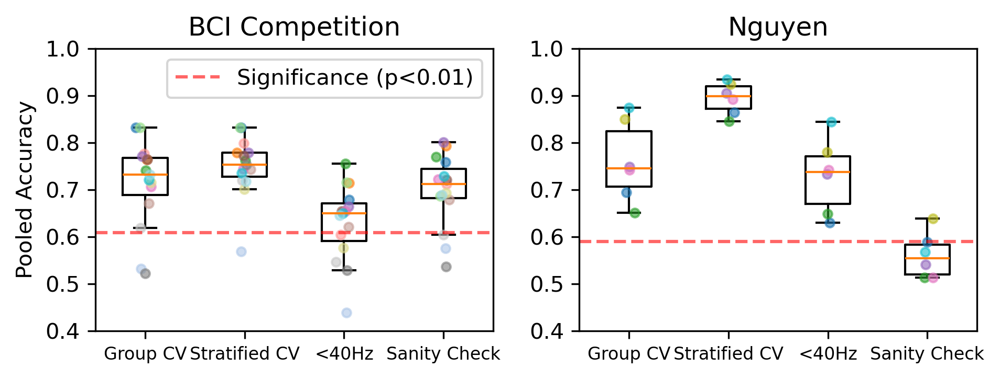
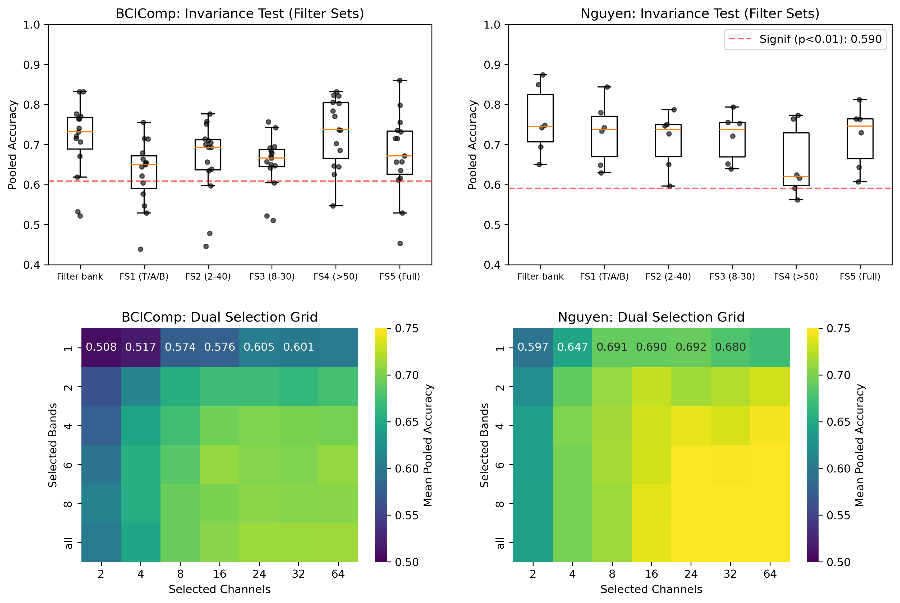
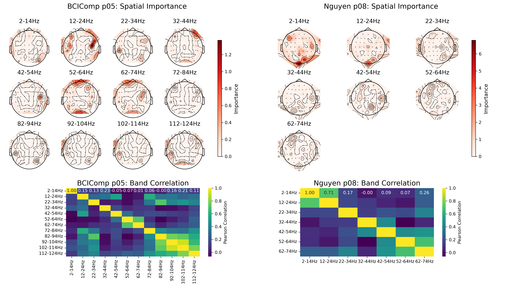

# Unboxing the Success of Riemannian Tangent Space Decoding for Speech Imagery

This repository contains the processing pipeline, analysis scripts, and high-resolution results for the study: **"Unpacking the Success of Riemannian Tangent Space Decoding for Speech Imagery"**. 

The study rigorously audits the TS+LR pipeline (Riemannian Tangent Space + L1-regularized Logistic Regression) by analyzing its performance against various physiological and methodological constraints across two major BCI datasets.

## 🧠 Key Research Questions
- **Leakage Check**: Does the model exploit intra-trial temporal correlations or "shortcuts"?
- **Source Validity**: Are the autonomously selected features neurophysiologically plausible (cortical vs. myogenic)?
- **Hyper-Compression**: Can classification stability be maintained under drastic spatial and spectral resolution reduction?
- **Spectral Invariance**: Is the pipeline robust to broader physiological frequency bands?

---

## 📊 Results & Visualizations

### 1. Methodology Validation & Leakage Detection
We evaluate the impact of Cross-Validation strategies (Group vs. Stratified) and perform a sanity check on the immediate post-imagery window. The red dashed line indicates the theoretical significance threshold ($p < 0.01$) derived from a binomial distribution.



### 2. Spatial-Spectral Hyper-Compression (Invariance Test)
We test classification stability by reducing spatial (channels) and spectral (frequency bands) resolutions. The boxplots compare the standard baseline against five neurophysiologically relevant filter sets.



### 3. Deep Dive: Spatial Importance & Band Correlation
For top-performing participants (e.g., BCIComp s05 and Nguyen sub_08), we analyze the topographic distribution of L1-weights and their cross-frequency spatial correlations. This confirms that the highest-weighted features are localized in task-relevant cortical regions (central, temporal, frontal) rather than lateral muscle artifacts.



---

## 📂 Repository Structure

- `run_on_val_dual_optimized.py`: High-efficiency hyperparameter sweep for the BCI Competition dataset.
- `nguyen_cv_dual_optimized.py`: High-efficiency hyperparameter sweep for the Nguyen dataset.
- `run_final_filter_sweep_bci.py`: Verification of specific frequency filter sets (FS1-FS5) for BCIComp.
- `run_final_filter_sweep_nguyen.py`: Verification of specific frequency filter sets (FS1-FS5) for Nguyen.
- `stat_analysis.py` / `invariance_stat_analysis.py`: Pairwise T-tests and statistical validation of results.
- `generate_*.py`: Automated plotting scripts for all compound figures.

## 🛰️ Data Sources

This repository **does not contain the raw EEG data**. To replicate the study, please download the datasets from:

1. **BCI Competition Dataset (Track 3)**:
   - **Task**: Binary classification of "Stop" vs. "Thank You" imagery.
   - **Source**: [Dropbox Dataset](https://www.dropbox.com/scl/fi/20j120qae7c2rlmr5lfwr/Dataset.zip?rlkey=0xjdairhprrakmw27d2fnesj7&e=1&dl=0)
2. **Nguyen et al. (2018) Dataset**:
   - **Task**: Binary classification of "Short" vs. "Long" word imagery.
   - **Source**: [OSF Repository](https://osf.io/pq7vb/overview)

## 🛠️ Installation & Usage

```bash
# Install required packages
pip install mne pyriemann scikit-learn numpy matplotlib seaborn scipy

# Run the optimized analysis pipeline
python run_optimized_parallel.py
python run_final_sweeps.py

# Generate the figures
python plot_methodology_comparison_v2.py
python generate_invariance_test.py
python generate_compound_analysis.py
```

---
*Developed at the University of Essex. xoxo*
